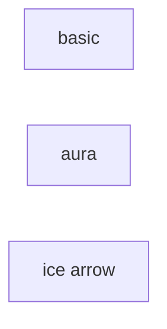
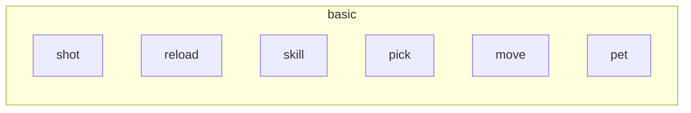
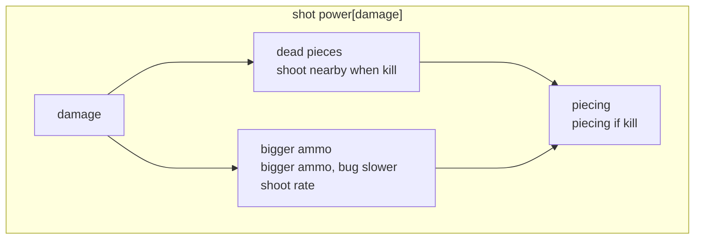

skills
--------------

### basic

### shot power

### shot far
### shot fast
### shot more
### reload fast
### shot damage

### ice
### fire
### lightening

### blade
### crystal
### ghost
### dragon

### heart
### shield
### run fast
### vision
### pick

### holy
### dark