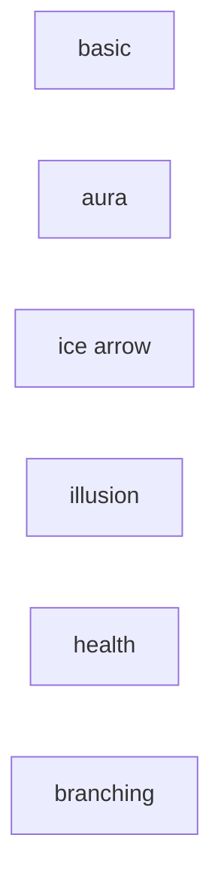
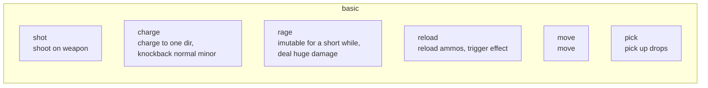
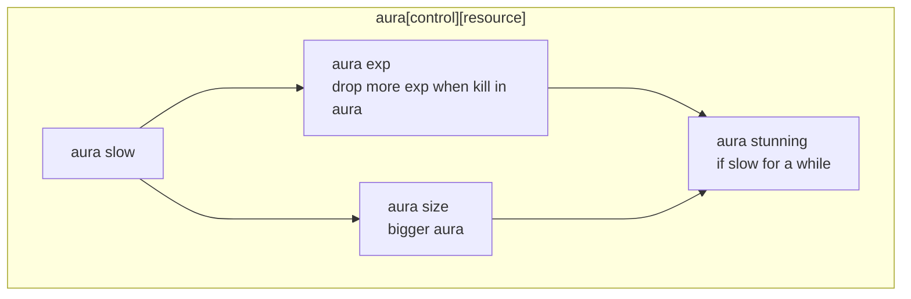
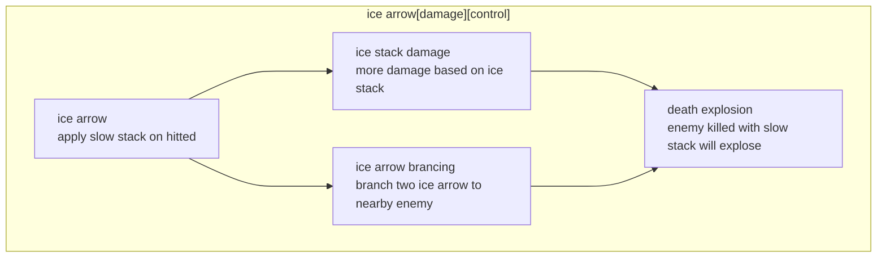
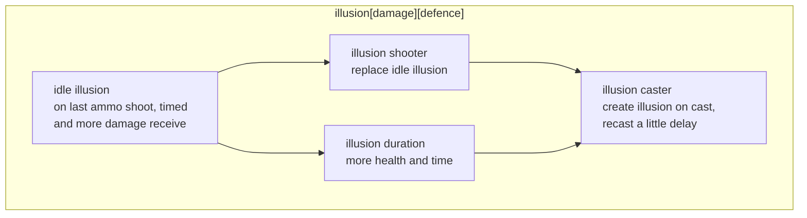
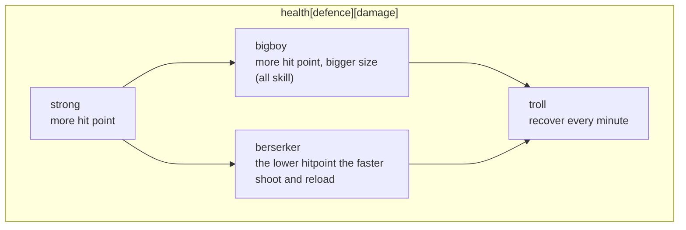
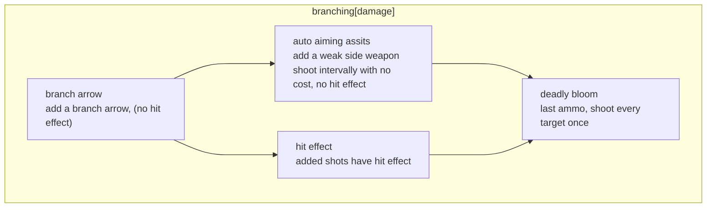

skills
--------------

```mermaid
graph LR;
    style A text-align:left
    style B text-align:left
    style C text-align:left

    A[basic]
    B[aura]
    C[ice arrow]
    D[illusion]
    E[health]
    F[branching]
```

### basic

```mermaid
graph LR;
    style A text-align:left
    style B text-align:left
    style C text-align:left
    style D text-align:left
    style E text-align:left
    style F text-align:left

    subgraph "basic"
        A[shot<br />shoot on weapon]
        B[charge<br />charge to one dir, knockback normal minor]
        C[rage<br />imutable for a short while, deal huge damage]
        D[reload<br />reload ammos, trigger effect]
        E[move<br />move]
        F[pick<br />pick up drops]
    end
```

### aura

```mermaid
graph TD;
    style A1 text-align:left
    style B1 text-align:left
    style C1 text-align:left
    style D1 text-align:left

    subgraph "aura[control][resource]"
        A1[aura slow]
        A1--->B1[aura exp<br />drop more exp when kill in aura]
        A1--->C1[aura size<br />bigger aura]
        B1 & C1 ---> D1[aura stunning<br />if slow for a while]
    end
```

### ice arrow

```mermaid
graph TD;
    style A1 text-align:left
    style B1 text-align:left
    style C1 text-align:left
    style D1 text-align:left

    subgraph "ice arrow[damage][control]"
        A1[ice arrow<br />apply slow stack on hitted]
        A1--->B1[ice stack damage<br />more damage based on ice stack]
        A1--->C1[ice arrow brancing<br />branch two ice arrow to nearby enemy]
        B1 & C1 ---> D1[death explosion<br />enemy killed with slow stack will explose]
    end
```

### illusion

```mermaid
graph TD;
    style A1 text-align:left
    style B1 text-align:left
    style C1 text-align:left
    style D1 text-align:left
    subgraph "illusion[damage][defence]"
        A1[idle illusion<br />on last ammo shoot, timed and more damage receive]
        A1--->B1[illusion shooter<br />replace idle illusion]
        A1--->C1[illusion duration<br />more health and time]
        B1 & C1 ---> D1[illusion caster<br />create illusion on cast, recast a little delay]
    end
```

### health

```mermaid
graph TD;
    style A1 text-align:left
    style B1 text-align:left
    style C1 text-align:left
    style D1 text-align:left

    subgraph "health[defence][damage]"
        A1[strong<br />more hit point]
        A1--->B1["bigboy<br />more hit point, bigger size (all skill)"]
        A1--->C1[berserker<br />the lower hitpoint the faster shoot and reload]
        B1 & C1 ---> D1[troll<br />recover every minute]
    end
```
### branching

```mermaid
graph TD;
    style A1 text-align:left
    style B1 text-align:left
    style C1 text-align:left
    style D1 text-align:left

    subgraph "branching[damage]"
        A1["branch arrow<br />add a branch arrow, (no hit effect)"]
        A1--->B1[auto aiming assits<br />add a weak side weapon shoot intervally with no cost, no hit effect]
        A1--->C1[hit effect<br />added shots have hit effect ]
        B1 & C1 ---> D1[deadly bloom<br />last ammo, shoot every target once]
    end
```